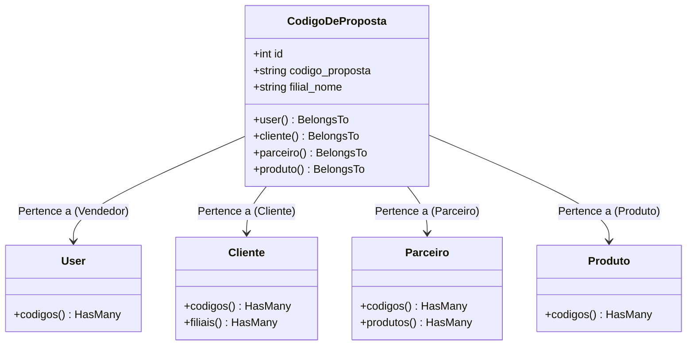

```mermaid
classDiagram
    class CodigoDeProposta {
        +int id
        +string codigo_proposta
        +string filial_nome
        +user() BelongsTo
        +cliente() BelongsTo
        +parceiro() BelongsTo
        +produto() BelongsTo
    }

    class User {
        +codigos() HasMany
    }

    class Cliente {
        +codigos() HasMany
        +filiais() HasMany
    }

    class Parceiro {
        +codigos() HasMany
        +produtos() HasMany
    }

    class Produto {
        +codigos() HasMany
    }

    CodigoDeProposta --> User : Pertence a (Vendedor)
    CodigoDeProposta --> Cliente : Pertence a (Cliente)
    CodigoDeProposta --> Parceiro : Pertence a (Parceiro)
    CodigoDeProposta --> Produto : Pertence a (Produto)
```